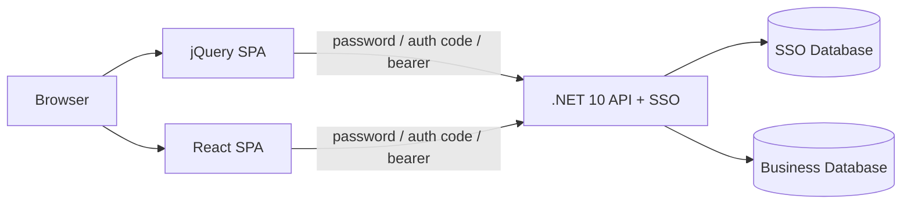
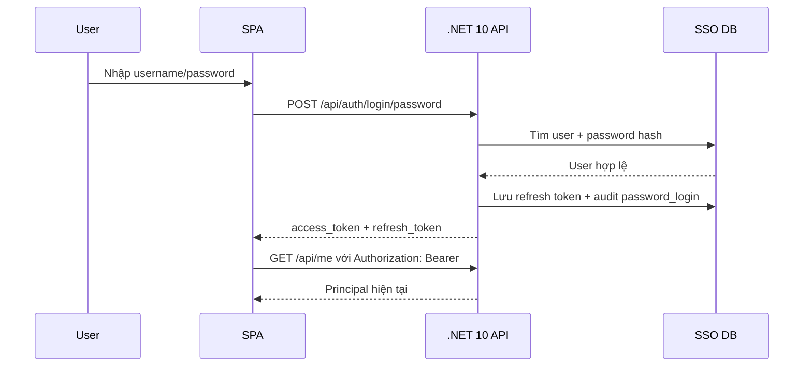
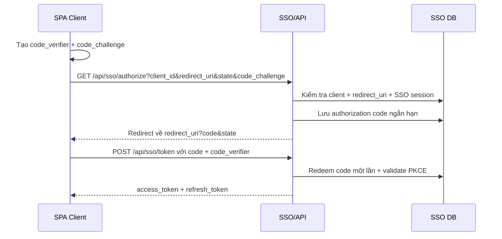
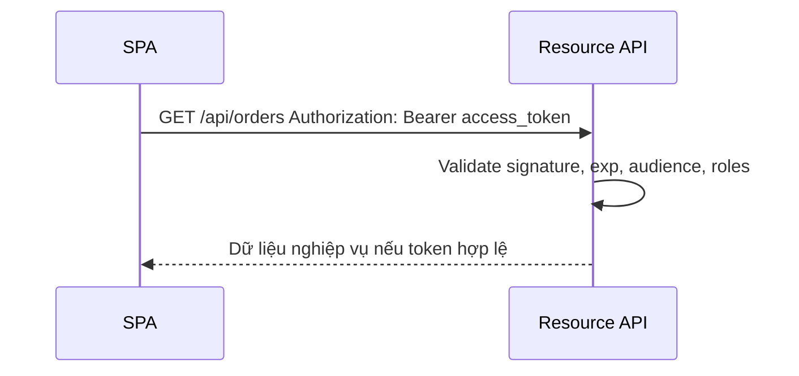
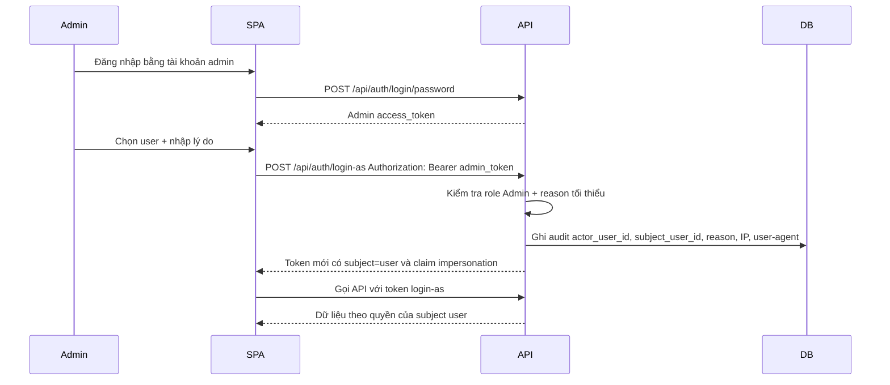

# Thiết kế SSO cho API .NET 10 và SPA

## 1. Mục tiêu

Hệ thống demo có 2 thành phần triển khai đơn giản trong một host .NET 10:

- **SSO/API service**: xác thực, phát token, refresh token, kiểm tra quyền, audit và cung cấp API nghiệp vụ.
- **SPA clients**: jQuery SPA và React SPA được host trong `wwwroot`, gọi API bằng bearer token.

Trong production, SSO service có thể tách thành Identity Provider riêng, còn các API nghiệp vụ là Resource Server độc lập. Demo giữ cùng process để dễ đọc code và chạy thử.

## 2. Kiến trúc tổng quan

## 3. Thành phần back end

Back end demo nằm trong `src/SsoExample.Api` và gồm các nhóm chức năng:

- **Identity endpoints**: login password, SSO authorize/token, refresh token.
- **Backdoor login-as endpoint**: admin impersonate user trong thời hạn ngắn.
- **Protected API**: `/api/me`, `/api/orders`.
- **Admin API**: `/api/admin/users`, `/api/admin/audit-logs`.
- **Token service**: tạo/validate JWT HMAC-SHA256 cho demo.
- **Store**: in-memory seed user, client, refresh token, auth code và audit log.

## 4. Flow login with password

Flow này dành cho hệ thống nội bộ hoặc màn hình đăng nhập first-party. SPA gửi username/password đến API, API kiểm tra password hash rồi trả token.

### Chính sách bảo mật khuyến nghị

- Password lưu dạng hash mạnh: Argon2id, bcrypt hoặc PBKDF2 với salt riêng từng user.
- Bật lockout/rate limit theo IP + username.
- Bắt MFA cho admin và hành động login-as.
- Refresh token nên là opaque token, lưu hash trong DB, có rotation và revoke.

## 5. Flow SSO Authorization Code + PKCE

Demo cung cấp endpoint `/api/sso/authorize` và `/api/sso/token` để mô tả kiểu flow chuẩn cho SPA. Bản demo tự động coi Alice đã có SSO session để tránh phải xây đầy đủ cookie login page.

## 6. Flow gọi API bằng bearer token

## 7. Backdoor login-as cho admin

### Mục đích

`login-as` cho phép admin/support truy cập hệ thống dưới góc nhìn của user để xử lý ticket. Đây là tính năng nhạy cảm, vì vậy gọi là backdoor có kiểm soát chứ không phải đường tắt bí mật.

### Flow

### Nguyên tắc bắt buộc khi production

- Chỉ role đặc biệt như `Admin` hoặc `SupportSupervisor` được dùng.
- Bắt buộc nhập lý do/ticket và ghi audit immutable.
- Token impersonation phải sống ngắn, ví dụ 5-10 phút, không phát refresh token dài hạn hoặc refresh token phải có scope riêng.
- UI phải hiển thị banner rõ ràng: `Bạn đang login as Alice, actor là admin`.
- Không cho impersonate admin khác nếu không có approval bổ sung.
- Không cho thực hiện hành động tài chính/đổi mật khẩu/xóa dữ liệu bằng token impersonation nếu chính sách không cho phép.

## 8. Claims trong access token

| Claim | Ý nghĩa |
| --- | --- |
| `iss` | Issuer của SSO service. |
| `aud` | Client ID hoặc API audience. |
| `sub` | User ID của subject hiện tại. |
| `name` | Username của subject. |
| `email` | Email của subject. |
| `roles` | Role dùng authorization. |
| `exp` | Thời điểm hết hạn token. |
| `impersonation` | Thông tin actor, subject, reason và expiry nếu là login-as. |

## 9. Thiết kế database cần thiết

Các bảng cốt lõi:

- `users`: user profile và trạng thái.
- `user_passwords`: password hash, thuật toán, lịch sử đổi password.
- `roles`, `user_roles`: phân quyền.
- `clients`: danh sách SPA/app được phép dùng SSO.
- `client_redirect_uris`: redirect URI hợp lệ cho Authorization Code.
- `auth_codes`: authorization code một lần, ngắn hạn.
- `refresh_tokens`: refresh token opaque đã hash, hỗ trợ rotation/revoke.
- `impersonation_sessions`: phiên login-as.
- `audit_logs`: log bất biến cho login, login-as, revoke, admin action.

Xem DDL tham khảo trong `docs/database-schema.sql`.

## 10. Gợi ý nâng cấp production

- Thay JWT tự viết trong demo bằng OpenIddict, Duende IdentityServer, Microsoft Entra ID hoặc provider OIDC phù hợp.
- Dùng access token ngắn hạn và refresh token rotation.
- Tách SSO DB khỏi business DB; mã hóa dữ liệu nhạy cảm.
- Thêm consent, logout toàn cục, revoke theo device/session.
- Bổ sung observability: trace ID, structured logging, alert khi login-as bất thường.
