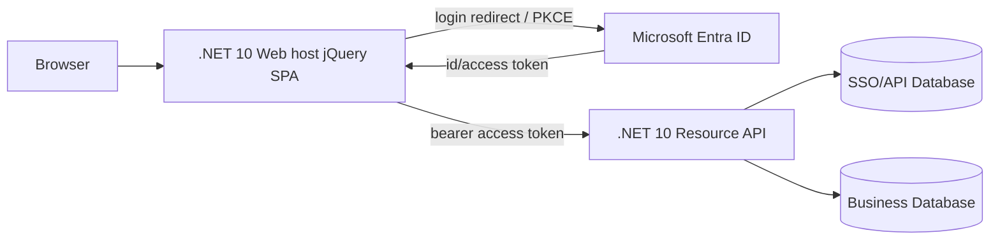
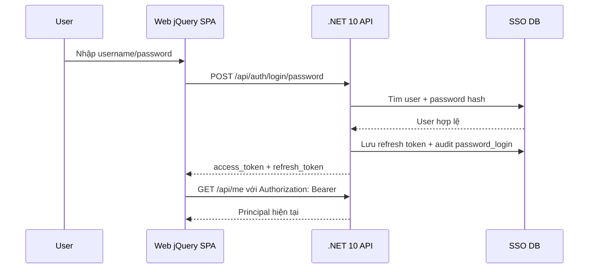
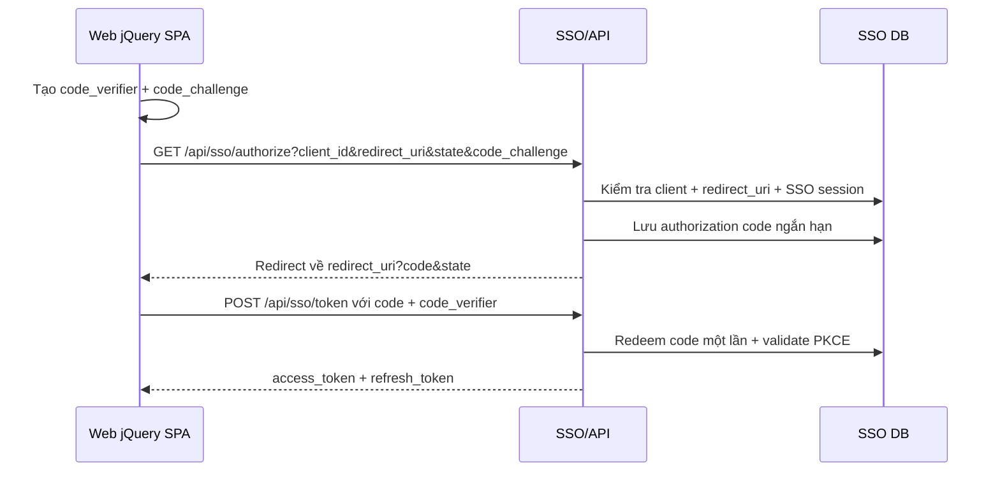
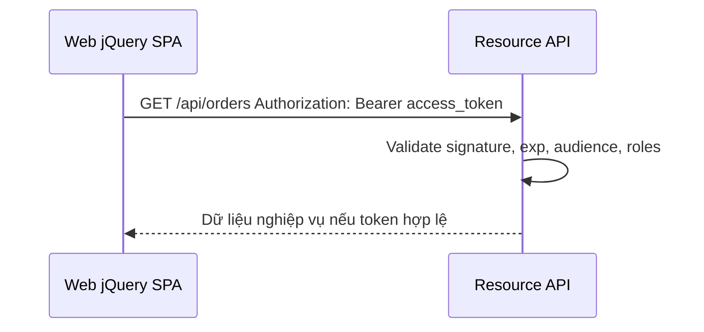

# Thiết kế SSO cho API .NET 10 và Web host jQuery SPA

## 1. Mục tiêu

Hệ thống demo có 2 project .NET 10 tách riêng:

- **SSO/API service** (`src/SsoExample.Api`): xác thực demo, phát/validate token demo, refresh token, kiểm tra quyền, audit và cung cấp API nghiệp vụ. Khi chuyển sang Microsoft Entra ID, project này đóng vai trò Resource API.
- **Web client** (`src/SsoExample.Web`): Web .NET 10 host jQuery SPA, giữ cấu hình client app registration, thực hiện login Authorization Code + PKCE bằng Microsoft Entra ID và gọi API bằng bearer token.

Trong production, Microsoft Entra ID là Identity Provider, API là Resource Server, còn Web là public client. Demo vẫn giữ local JWT endpoints để dễ đọc code và chạy thử.

## 2. Kiến trúc tổng quan

## 3. Thành phần back end

API demo nằm trong `src/SsoExample.Api` và gồm các nhóm chức năng:

- **Identity endpoints**: login password, SSO authorize/token, refresh token.
- **Backdoor login-as endpoint**: admin impersonate user trong thời hạn ngắn.
- **Protected API**: `/api/me`, `/api/orders`.
- **Admin API**: `/api/admin/users`, `/api/admin/audit-logs`.
- **Token service**: tạo/validate JWT HMAC-SHA256 cho demo.
- **Store**: in-memory seed user, client, refresh token, auth code và audit log.

## 4. Flow login with password

Flow này chỉ còn là local demo để giải thích token/impersonation. Khi dùng Microsoft Entra ID thật, Web nên redirect user sang Entra ID thay vì tự thu username/password.

### Chính sách bảo mật khuyến nghị

- Password lưu dạng hash mạnh: Argon2id, bcrypt hoặc PBKDF2 với salt riêng từng user.
- Bật lockout/rate limit theo IP + username.
- Bắt MFA cho admin và hành động login-as.
- Refresh token nên là opaque token, lưu hash trong DB, có rotation và revoke.

## 5. Flow SSO Authorization Code + PKCE

Với Microsoft Entra ID thật, Web dùng Authorization Code + PKCE trực tiếp với Entra ID. Các endpoint `/api/sso/authorize` và `/api/sso/token` trong API chỉ là mô phỏng local để giải thích flow.

## 6. Flow gọi API bằng bearer token

## 7. Backdoor login-as cho admin

### Mục đích

`login-as` cho phép admin/support truy cập hệ thống dưới góc nhìn của user để xử lý ticket. Đây là tính năng nhạy cảm, vì vậy gọi là backdoor có kiểm soát chứ không phải đường tắt bí mật.

### Flow

### Nguyên tắc bắt buộc khi production

- Chỉ role đặc biệt như `Admin` hoặc `SupportSupervisor` được dùng.
- Bắt buộc nhập lý do/ticket và ghi audit immutable.
- Token impersonation phải sống ngắn, ví dụ 5-10 phút, không phát refresh token dài hạn hoặc refresh token phải có scope riêng.
- UI phải hiển thị banner rõ ràng: `Bạn đang login as Alice, actor là admin`.
- Không cho impersonate admin khác nếu không có approval bổ sung.
- Không cho thực hiện hành động tài chính/đổi mật khẩu/xóa dữ liệu bằng token impersonation nếu chính sách không cho phép.

## 8. Claims trong access token

| Claim | Ý nghĩa |
| --- | --- |
| `iss` | Issuer của SSO service. |
| `aud` | Client ID hoặc API audience. |
| `sub` | User ID của subject hiện tại. |
| `name` | Username của subject. |
| `email` | Email của subject. |
| `roles` | Role dùng authorization. |
| `exp` | Thời điểm hết hạn token. |
| `impersonation` | Thông tin actor, subject, reason và expiry nếu là login-as. |

## 9. Thiết kế database cần thiết

Các bảng cốt lõi:

- `users`: user profile và trạng thái.
- `user_passwords`: password hash, thuật toán, lịch sử đổi password.
- `roles`, `user_roles`: phân quyền.
- `clients`: danh sách Web/client app được phép dùng SSO.
- `client_redirect_uris`: redirect URI hợp lệ cho Authorization Code.
- `auth_codes`: authorization code một lần, ngắn hạn.
- `refresh_tokens`: refresh token opaque đã hash, hỗ trợ rotation/revoke.
- `impersonation_sessions`: phiên login-as.
- `audit_logs`: log bất biến cho login, login-as, revoke, admin action.

Xem DDL tham khảo trong `docs/database-schema.sql`.

## 10. Gợi ý nâng cấp production

- Thay JWT tự viết trong demo bằng OpenIddict, Duende IdentityServer, Microsoft Entra ID hoặc provider OIDC phù hợp.
- Dùng access token ngắn hạn và refresh token rotation.
- Tách SSO DB khỏi business DB; mã hóa dữ liệu nhạy cảm.
- Thêm consent, logout toàn cục, revoke theo device/session.
- Bổ sung observability: trace ID, structured logging, alert khi login-as bất thường.

## 11. Appsettings và các bước tạo Microsoft Entra ID apps

Demo hiện có **hai project** để khớp với hai app registration trên Azure:

| Project trong repo | Azure app registration đề xuất | Vai trò |
| --- | --- | --- |
| `src/SsoExample.Api` | `SSOExample.Api` | Resource API: validate access token, audience và scope. |
| `src/SsoExample.Web` | `SSOExample.Web` | Public Web host jQuery SPA: login bằng Authorization Code + PKCE và gọi API. |

> Microsoft Entra ID là tên mới của Azure Active Directory. Trong Azure Portal, bạn vào **Microsoft Entra ID** rồi cấu hình trong **App registrations**.

### 11.1. Tạo app registration cho API: `SSOExample.Api`

1. Vào **Azure Portal** > **Microsoft Entra ID** > **App registrations** > **New registration**.
2. Nhập **Name**: `SSOExample.Api`.
3. Chọn **Supported account types** theo nhu cầu tenant, thường là **Accounts in this organizational directory only** cho app nội bộ.
4. Không cần nhập redirect URI cho API ở bước này.
5. Sau khi tạo, copy các giá trị:
   - **Directory (tenant) ID** -> `Authentication:MicrosoftEntraId:TenantId` trong API.
   - **Application (client) ID** -> `Authentication:MicrosoftEntraId:Api:ClientId` trong API.
6. Vào **Expose an API**:
   - Set **Application ID URI** thành `api://<ssoexample-api-app-client-id>`.
   - Add scope tên `access_as_user`.
   - Điền display name/description, ví dụ `Access SSOExample API as signed-in user`.
   - Bật **Admins and users** nếu muốn user consent; với app nội bộ có thể chỉ dùng admin consent.
7. Nếu cần phân quyền theo role, vào **App roles** và tạo role như `Admin`, `Support`, `User`. Phần demo local hiện vẫn dùng roles tự phát, nhưng khi chuyển hẳn sang Entra ID thì API nên đọc roles/groups từ token Entra ID.

API appsettings được tách thành `src/SsoExample.Api/appsettings.Required.json` và `src/SsoExample.Api/appsettings.Optional.json`. Ở đây **Required** nghĩa là bắt buộc cho flow SSO Microsoft Entra ID; local JWT demo chỉ là flow mô phỏng nên nằm ở Optional.

| File | Key | Ý nghĩa |
| --- | --- | --- |
| Required | `Authentication:Provider` | Đặt `MicrosoftEntraId` để chọn provider SSO. |
| Required | `Authentication:MicrosoftEntraId:TenantId` / `Authority` | Tenant và issuer/authority mà API tin cậy khi validate token. |
| Required | `Authentication:MicrosoftEntraId:Api:ClientId` | Application/client ID của API app registration. |
| Required | `Authentication:MicrosoftEntraId:Api:ApplicationIdUri` | App ID URI expose API, thường là `api://<api-client-id>`. |
| Required | `Authentication:MicrosoftEntraId:Api:Audience` | Audience API validate trong access token, thường trùng `ApplicationIdUri`. |
| Required | `Authentication:MicrosoftEntraId:Api:Scopes:AccessAsUser` | Scope ngắn `access_as_user`; token gửi tới API phải có scope này. |
| Required | `Authentication:MicrosoftEntraId:AllowedClientApplications[].ClientId` | Client app registration được phép gọi API, ví dụ Web app `SSOExample.Web`. |
| Optional | `Sso:*` | Cấu hình local JWT demo để chạy flow mô phỏng không qua Entra ID. |
| Optional | `TenantName` / `AzureAppRegistrationName` | Tên hiển thị để dễ đối chiếu với Azure Portal, không phải giá trị kỹ thuật bắt buộc để validate token. |
| Optional | `AllowedHosts` | Host filtering mặc định của ASP.NET Core. |

### 11.2. Tạo app registration cho Web: `SSOExample.Web`

1. Vào **Azure Portal** > **Microsoft Entra ID** > **App registrations** > **New registration**.
2. Nhập **Name**: `SSOExample.Web`.
3. Chọn cùng **Supported account types** với API nếu đây là app nội bộ.
4. Trong **Redirect URI**, chọn platform **Single-page application (SPA)** vì jQuery SPA chạy JavaScript/MSAL trong browser.
5. Thêm redirect URI dev:
   - `https://localhost:5002/auth/callback`
6. Sau khi tạo, copy **Application (client) ID** -> `MicrosoftEntraId:ClientId` trong `src/SsoExample.Web/appsettings.Required.json`.
7. Vào **Authentication** của `SSOExample.Web`:
   - Đảm bảo redirect URIs ở trên nằm trong platform **Single-page application**.
   - Thêm **Front-channel logout URL** hoặc logout redirect nếu cần, ví dụ `https://localhost:5002/`.
   - Với jQuery SPA/public client, không tạo hoặc không dùng `client secret` trong browser.
8. Vào **API permissions** > **Add a permission** > **My APIs** > chọn `SSOExample.Api`.
9. Chọn delegated permission `access_as_user` rồi **Add permissions**.
10. Nếu tenant yêu cầu, bấm **Grant admin consent** cho permission vừa thêm.

Web appsettings được tách thành `src/SsoExample.Web/appsettings.Required.json` và `src/SsoExample.Web/appsettings.Optional.json`. Ở đây **Required** nghĩa là bắt buộc để Web thực hiện login SSO và gọi API bằng access token Entra ID.

| File | Key | Ý nghĩa |
| --- | --- | --- |
| Required | `MicrosoftEntraId:TenantId` / `Authority` | Tenant authority để Web/MSAL login user. |
| Required | `MicrosoftEntraId:ClientId` | Application/client ID của `SSOExample.Web`. |
| Required | `MicrosoftEntraId:RedirectUris` | Redirect URIs đã khai báo trong Azure cho Web host jQuery SPA. |
| Required | `MicrosoftEntraId:Scopes` | OIDC scopes và API scope `api://<api-client-id>/access_as_user`. |
| Required | `Api:BaseUrl` | URL backend API, demo dùng `https://localhost:5001`. |
| Required | `Api:Audience` / `Api:RequiredScope` | Audience và scope của API mà Web cần xin token để gọi backend. |
| Optional | `Api:LocalDemoClientId` | Client ID nội bộ `ssoexample-web` chỉ dùng cho local JWT demo. |
| Optional | `MicrosoftEntraId:TenantName` | Tên hiển thị tenant để dễ đối chiếu với Azure Portal. |
| Optional | `MicrosoftEntraId:PostLogoutRedirectUri` | URL quay về sau logout nếu app bật logout redirect. |
| Optional | `MicrosoftEntraId:CacheLocation` | Nơi lưu token phía browser, demo dùng `sessionStorage`. |
| Optional | `AllowedHosts` | Host filtering mặc định của ASP.NET Core. |

### 11.3. Mapping giá trị Azure vào appsettings

| Giá trị trên Azure Portal | Điền vào API | Điền vào Web |
| --- | --- | --- |
| Tenant `Directory (tenant) ID` | `Authentication:MicrosoftEntraId:TenantId` | `MicrosoftEntraId:TenantId` |
| Tenant domain/name | `Authentication:MicrosoftEntraId:TenantName` | `MicrosoftEntraId:TenantName` |
| API app name | `Authentication:MicrosoftEntraId:Api:AzureAppRegistrationName = SSOExample.Api` | Không cần, chỉ reference qua scope/API URL. |
| API app client ID | `Authentication:MicrosoftEntraId:Api:ClientId` | Dùng trong scope `api://<api-client-id>/access_as_user`. |
| API Application ID URI | `Authentication:MicrosoftEntraId:Api:ApplicationIdUri` và `Audience` | `Api:Audience` |
| Web app name | Trong `AllowedClientApplications[].AzureAppRegistrationName = SSOExample.Web` | Tên app registration là `SSOExample.Web`. |
| Web app client ID | Trong `AllowedClientApplications[].ClientId` | `MicrosoftEntraId:ClientId` |
| Web redirect URIs | Không cần ở API | `MicrosoftEntraId:RedirectUris` |

### 11.4. Checklist sau khi tạo app trên Azure

- `SSOExample.Api` đã expose scope `access_as_user`.
- `SSOExample.Web` đã có delegated API permission tới `SSOExample.Api/access_as_user`.
- Redirect URI trong Azure khớp chính xác với URL trong `src/SsoExample.Web/appsettings.Required.json`.
- API validate đúng `Authority`, `Audience` và scope.
- Không đặt `client secret` trong Web appsettings, JavaScript, hoặc file tĩnh vì jQuery SPA là public client.
- Với production, nên dùng Key Vault/App Configuration cho cấu hình theo môi trường và không commit giá trị thật của tenant/client IDs nếu repo public.
